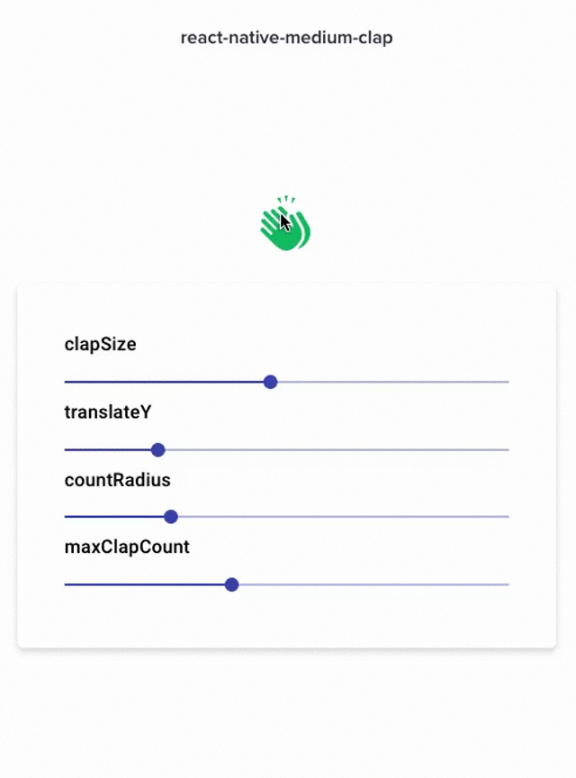

<h2><div>react-native-medium-clap</div></h2>


Highly Customizable Medium Clap Component for react-native & react-native-web.

## Installation
#### 1) Make sure to first install & configure `react-native-svg` 
- https://github.com/react-native-community/react-native-svg#installation

#### 2) Install react-native-medium-clap
```
npm install react-native-medium-clap
```

## Usage
```javascript
import MediumClap from 'react-native-medium-clap'


const ClapExample = () => {
  
  const onClapIncrease = (clap) => console.log(`Number of Claps: ${clap}`)

  return (
    <View>
      <MediumClap
        onClapIncrease={onClapIncrease}
        color="07AF6A"
        clapSize={50}
        translateY={30}
        countRadius={15}
        countTextStyle={{ fontSize:16 }}
        maxClapCount={45}
      />
    </View>

  )

}

```

## Configuration

| Property      | Type          | Default             | Description |
| -------------     |:-------------:|:------------:       | ----------- |
| onClapIncrease    | function      | () => {}     | callback function on clap increase
| clapSize          | number        | 45           | use this to change the size of clap icon
| color             | string        | #07AF6A      | use this to change primary color of component
| translateY        | number        | 20           | use this to change the translation in y direction 
| maxClapCount      | number        | 50           | use this to limit the clap count increase
| countRadius       | number        | 20           | use this to change the size of count component/circle
| countTextStyle    | style         | {}           | use this to apply styles to count text

## Showcase



## Author
This library is brought to you by [Piyush Gupta ( kida007 )](https://twitter.com/kidaa007)

## License
MIT

